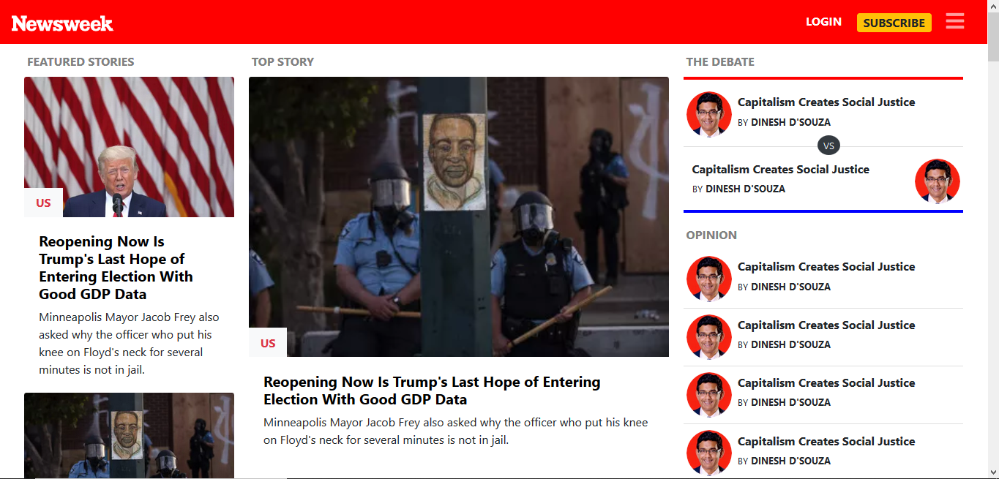

## Using Bootstrap

Project: Using Bootstrap

## Description

this is a clone of the Newsweek website built base on Bootstrap

##Screenshot of the website



## Built With

- BOOTSTRAP 4
- HTML5
- CSS3

## Live Demo

[Live Demo Link](https://rawcdn.githack.com/rida-elbahtouri/-Bootstrap-project/7d49d470a04f470c86503638e75027c5a80f564a/index.html)

# Getting Started 🚀

These instructions will get you a copy of the project up and running on your local machine.

## How To Use 🔧

From your command line, first clone the project:

```bash
# Clone this repository
$ git clone https://github.com/rida-elbahtouri/-Bootstrap-project.git

# Go into the repository
$ cd -Bootstrap-project

```

## DEVELOPER

👤 **Rida Elbahtouri**

- [Github](https://github.com/rida-elbahtouri)
- [Twitter](https://twitter.com/RElbahtouri)
- [Linkedin](https://www.linkedin.com/in/rida-elbahtouri-36a8a7185/)

## Show your support

Give a ⭐️ if you like this project!
